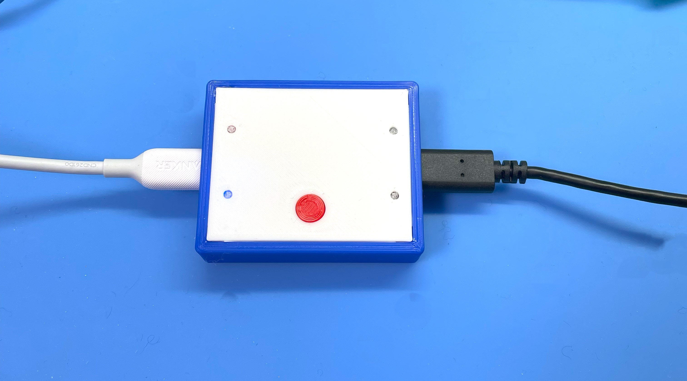
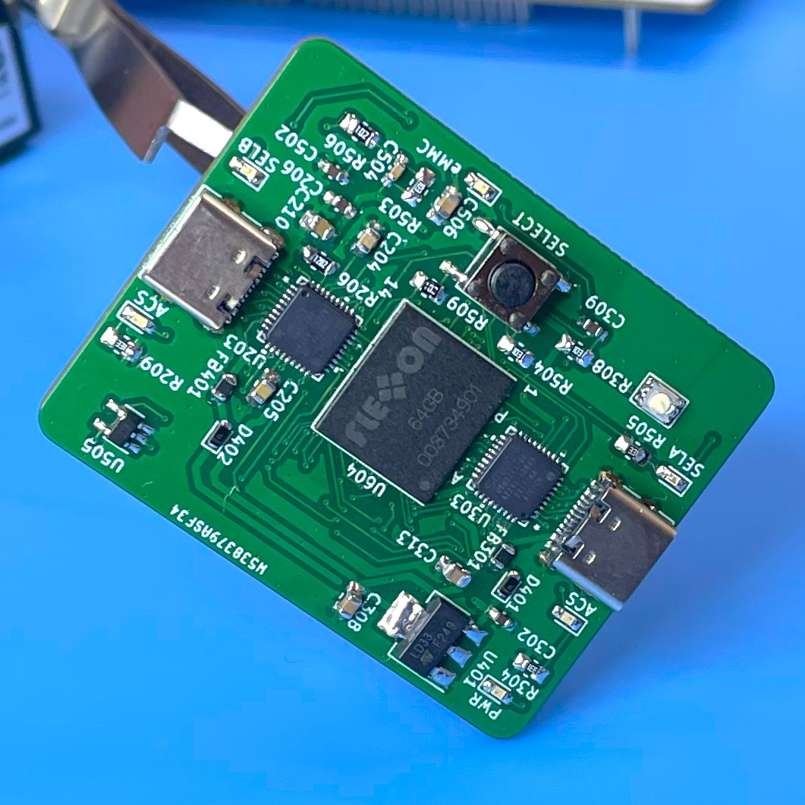
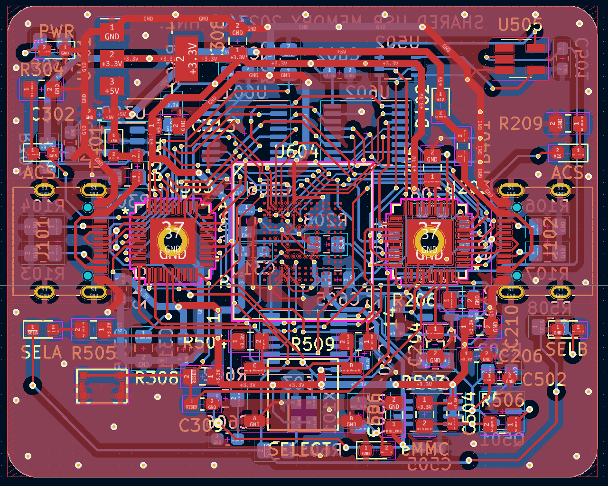
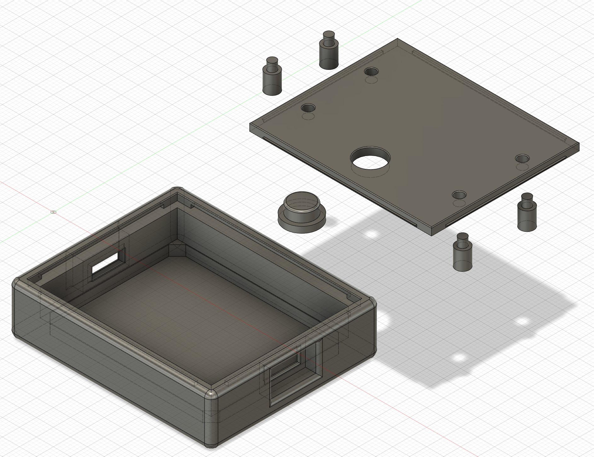

  <h1><code>SHARED-USB-MEMORY</code></h1>
  

    
  

# Shared USB Memory : USB Memory with One-touch Switching Between Two Device Connections

https://github.com/hnz1102/shared-usb-memory/assets/111413646/2c444520-a98f-45e1-a0ac-f0b2667a8621

This memory provides convenient and quick-to-switch connections between two host devices such as PCs.

When the network is not available, data is transferred by copying data to and from a USB memory stick or SD card. However, since removing and inserting USB memory sticks and SD cards is a hassle, the Box can be switched at the touch of a button to pass data back and forth.

To use, connect this Box between two PCs with a Type-C cable. The disk will be recognized by the PC connected to the left port. Then, copy data here, and when the red access blinking stops, press the red button. Then the disk will be recognized in the PC of right port and you can retrieve the data. Press the red button again to return the disk to the left PC. In this way, data can be exchanged without having to remove and insert the USB memory stick.

The box can be run on the Windows OS, MacOS, and Linux OS without special drivers.

## Schematic

This Board Schematic and a PCB layout are placed in this directory. 
Schematic data is created by KidCad 7.0.

After assembling the board, It has to configure EEPROMs of the USB Media Controller.

The USB Media Controller has an EEPROM. It is programmed with the parameters by [USBDM tool](https://www.microchip.com/en-us/software-library/usbdm-tool).

- Manufacture String
- Serial Number String

This board has two USB Media Controller. Connect to each of the two respective USB ports and rewrite the information with the USBDM tool. 

# Container

There are STL data for 3D printer in the `stl` directory.

## LICENSE
Hardware Schematic Documents are licensed under CC-BY-SA V4.0.
